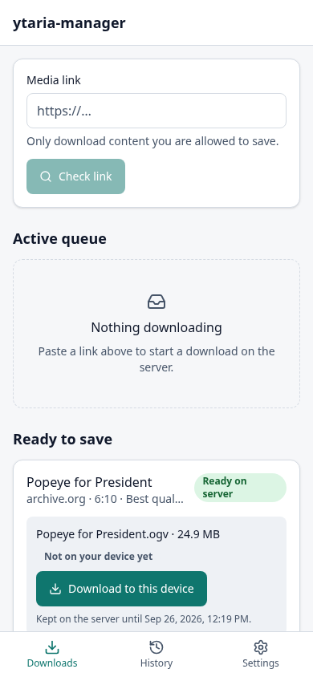
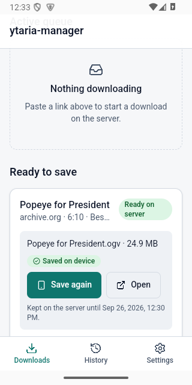

# ytaria-manager

A secure, multi-user download manager with a **web app** and an **Android app**. Users sign in, submit a supported media URL,
pick a quality, and a server-side worker (yt-dlp + aria2c + ffmpeg) downloads it. The finished file is stored privately on the
server and then transferred to the user's browser or phone. Use it only for content you are authorised to download.

| Web: ready on the server | Android: saved on the device |
| --- | --- |
|  |  |

> "Ready on server" and "Saved on device" are different states. Downloading on the server never saves anything on a phone by itself.

## Stack
FastAPI + Pydantic · PostgreSQL + SQLAlchemy + Alembic · Celery + Redis · yt-dlp/aria2c/ffmpeg · React 19 + TypeScript + Vite + Tailwind 4 ·
Capacitor 8 (Android first) · Docker Compose + Nginx on one Linux VPS.

## Quick start (development)
```bash
docker run -d --name ytaria-dev-pg -e POSTGRES_USER=ytaria -e POSTGRES_PASSWORD=dev -e POSTGRES_DB=ytaria -p 127.0.0.1:55432:5432 postgres:17-alpine
docker run -d --name ytaria-dev-redis -p 127.0.0.1:56379:6379 redis:7-alpine
python3 -m venv .venv && .venv/bin/pip install -r backend/requirements-dev.txt
cd backend && ../.venv/bin/alembic upgrade head
export YTARIA_ALLOW_DIRECT_EGRESS=true                     # dev only; production forces the egress proxy
../.venv/bin/uvicorn app.main:app &                        # API on :8000
../.venv/bin/celery -A app.worker.celery_app worker -Q downloads,inspect,maintenance -c 3 &
../.venv/bin/celery -A app.worker.celery_app beat &
cd ../frontend && npm ci && npm run dev                    # http://127.0.0.1:5173
```
Or run the whole production-shaped stack locally (HTTP on :8080, real egress boundary):
`docker compose -f docker-compose.yml -f docker-compose.dev.yml --env-file .env up --build`.
Full details: [docs/DEVELOPMENT.md](docs/DEVELOPMENT.md).

## Android
`cd frontend && npm run build:android && (cd android && ./gradlew assembleDebug)` – see [docs/ANDROID.md](docs/ANDROID.md)
(signing, release build, emulator evidence, limits: the device transfer is foreground-only).

## Deploy
`.env` → `docker compose up -d` → `./deploy/certbot.sh init DOMAIN EMAIL`. Only Nginx publishes ports. See
[docs/DEPLOYMENT.md](docs/DEPLOYMENT.md) (HTTPS, backup/restore, upgrade/rollback, sizing, scaling) and read
[docs/SECURITY.md](docs/SECURITY.md) before exposing it publicly.

## Documentation
[Architecture & job state machine](docs/ARCHITECTURE.md) · [Security](docs/SECURITY.md) · [Deployment](docs/DEPLOYMENT.md) ·
[Android](docs/ANDROID.md) · [Development & tests](docs/DEVELOPMENT.md) · [Legacy mode & import](docs/LEGACY.md) ·
[Baseline review](docs/BASELINE.md) · [Progress / hand-off](docs/PROGRESS.md)

## Legacy local tool
The original single-user script (`ytaria.py`, TUI, `start-web.sh`, …) still works on its own SQLite database, with the unsafe
features removed (browser cookies, infinite retries, client-chosen output directory, option injection). It is not connected to the new queue.
`python3 ytaria.py serve --host 127.0.0.1 --port 8787` · `python3 ytaria.py tui` · `python3 ytaria.py add <url>`.
See [docs/LEGACY.md](docs/LEGACY.md) for the differences and the optional, explicit `import-legacy` command.

## Layout
```
backend/    FastAPI app, Celery worker, egress proxy, migrations, tests      frontend/  React app + Capacitor Android project
deploy/     Nginx, certbot, backup/restore, egress probe                     docs/      documentation
docker-compose.yml  docker-compose.dev.yml  .env.example  .github/workflows/ci.yml  ytaria.py (legacy)
```

## Credit
Developed and maintained by **Elia William Mariki (dawillygene)**, a systems software engineer based in Dodoma, Tanzania.

Website: [dawillygene.com](https://www.dawillygene.com/)
