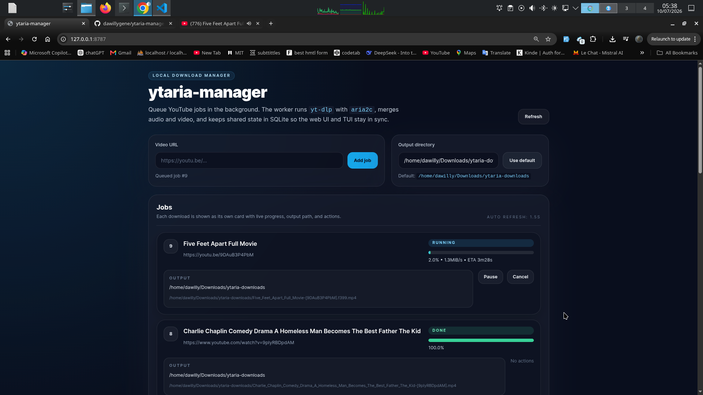

# ytaria-manager

Local YouTube-style download manager built on `yt-dlp`, `aria2c`, and SQLite.



## Overview

`ytaria-manager` gives you a simple local interface for queueing video downloads, watching live progress, and controlling jobs without using the terminal for every action.

It includes:

- A local web UI for queueing and managing downloads
- A shared SQLite job queue
- A background worker powered by `yt-dlp` and `aria2c`
- A curses TUI that reads the same jobs as the web app
- Pause, resume, cancel, and retry controls

## Stack

- `python3`
- `yt-dlp`
- `aria2c`
- `ffmpeg`
- `sqlite3`

## Requirements

Make sure these are installed and available in your shell:

- `python3`
- `yt-dlp`
- `aria2c`
- `ffmpeg`

## Start The Web UI

Run in the foreground:

```bash
cd /home/dawilly/Downloads/ytaria-manager
python3 ytaria.py serve --host 127.0.0.1 --port 8787
```

Run in the background:

```bash
cd /home/dawilly/Downloads/ytaria-manager
python3 ytaria.py serve --host 127.0.0.1 --port 8787 --background
```

Open:

- `http://127.0.0.1:8787/`

## Start The TUI

```bash
cd /home/dawilly/Downloads/ytaria-manager
python3 ytaria.py tui
```

Keys:

- `a` add a URL
- `r` refresh
- `q` quit

## Queue Jobs From CLI

```bash
python3 ytaria.py add "https://youtu.be/tYp-UskX0cM"
python3 ytaria.py list
```

## Download Behavior

The worker runs downloads with:

```bash
yt-dlp -f "bv*+ba" \
  --downloader aria2c \
  --merge-output-format mp4
```

## Job Controls

- `Pause` stops the active download and keeps resume data
- `Continue` requeues a paused job and resumes it
- `Cancel` stops a queued or running job
- `Retry` restarts a failed or canceled job
- Live progress, speed, ETA, and output path are shown in the UI

## Storage

- SQLite database: `~/.local/share/ytaria-manager/jobs.sqlite3`
- Default output directory: `~/Downloads/ytaria-downloads`

## Project Files

- [ytaria.py](ytaria.py) main application with web UI, worker, API, and TUI
- [start-web.sh](start-web.sh) helper to launch the web app in background mode
- [start-tui.sh](start-tui.sh) helper to launch the terminal UI

## Credit

Developed and maintained by **dawillygene**.
